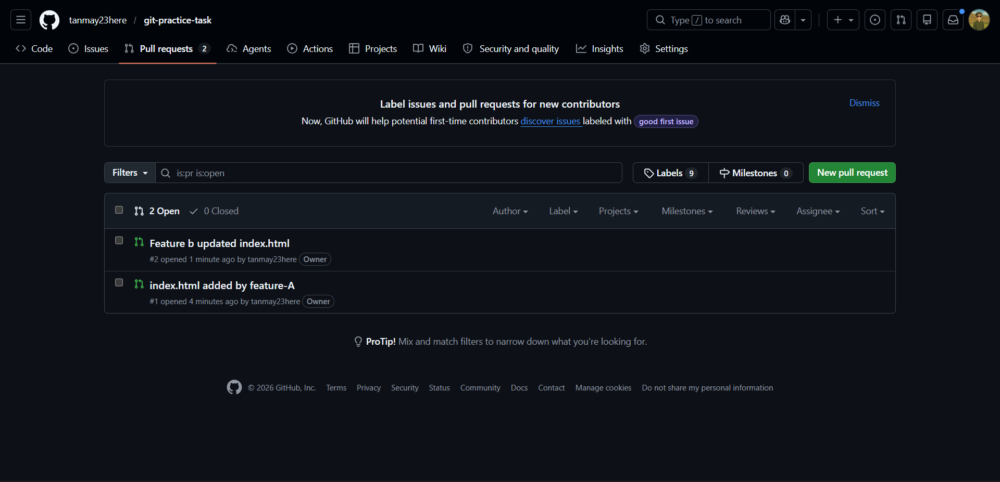
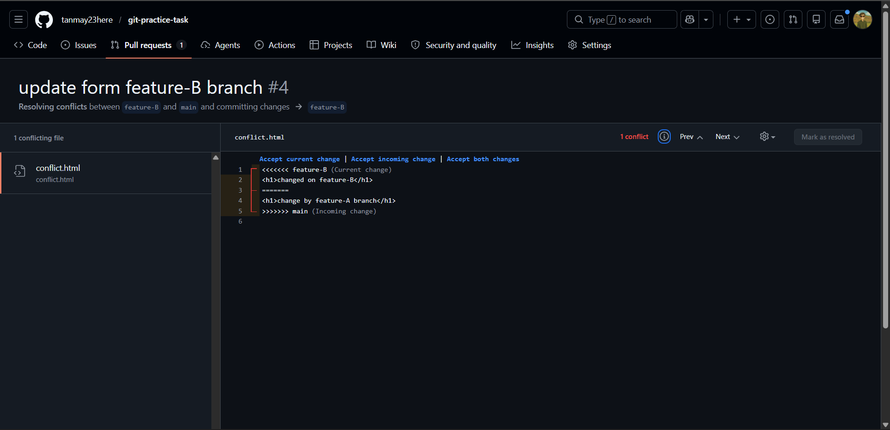
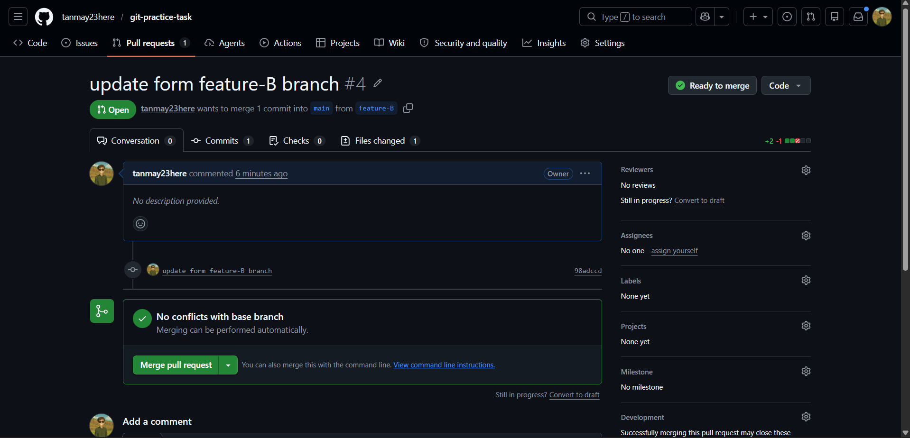
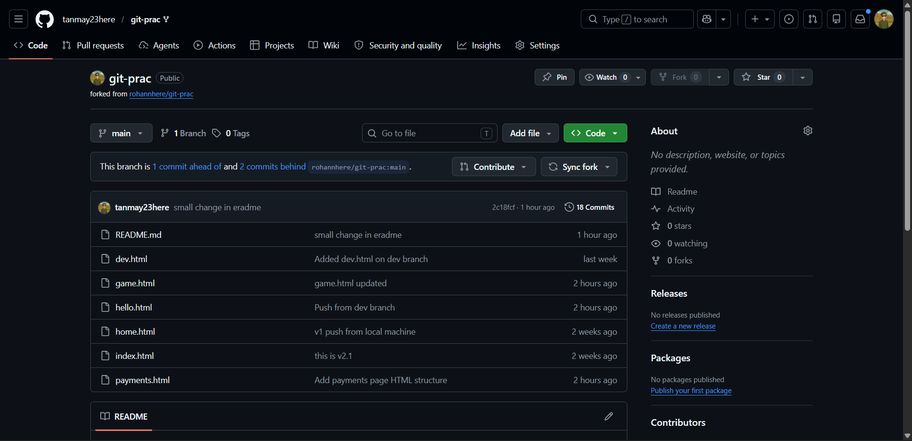
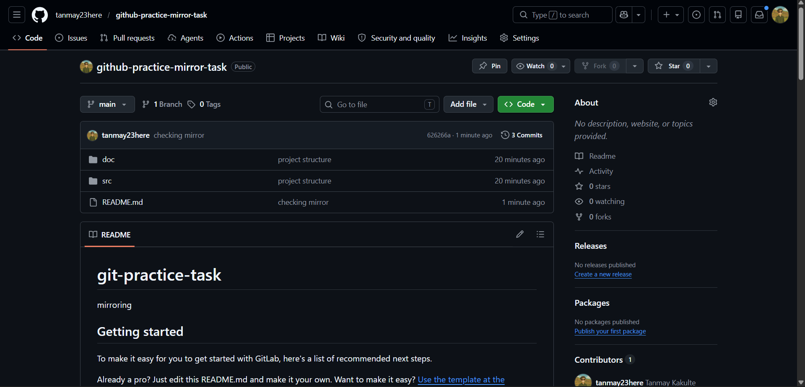
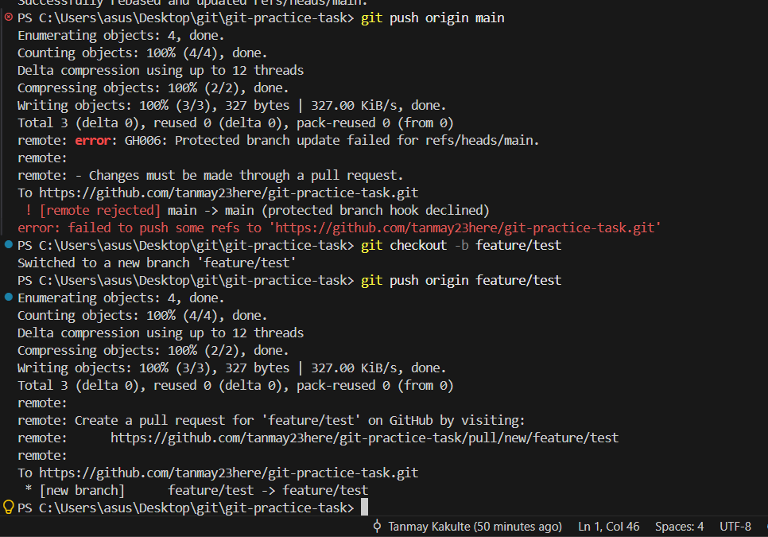
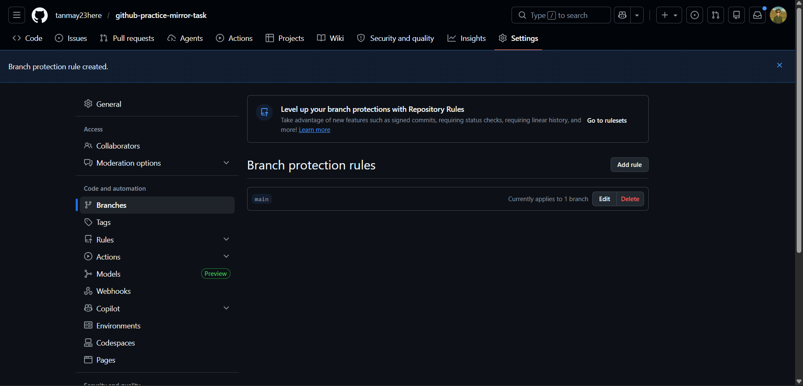

# Git & GitLab Practical Assignment

## Overview
This repository was created as part of the **Git & GitLab Practical Assignment** to demonstrate hands-on experience with:

- Git repository management
- GitHub collaboration workflow
- Branching strategy
- Pull Requests and code reviews
- Merge conflict resolution
- Forking and contributing
- GitLab repository management
- Repository mirroring between GitLab and GitHub
- Branch protection rules

---

## Assignment Completion Status

| Task | Description | Status |
|--------|-------------|---------|
| 1 | GitHub Repository Creation | ✅ Completed |
| 2 | Repository Clone | ✅ Completed |
| 3 | Initial Development on Main Branch | ✅ Completed |
| 4 | Feature-A Branch Creation | ✅ Completed |
| 5 | Pull Request (feature-A → main) | ✅ Completed |
| 6 | Feature-B Branch Creation | ✅ Completed |
| 7 | Merge Feature-A | ✅ Completed |
| 8 | Merge Conflict Resolution | ✅ Completed |
| 9 | Merge Feature-B | ✅ Completed |
| 10 | Fork and Contribution | ✅ Completed |
| 11 | GitLab Repository Setup | ✅ Completed |
| 12 | Repository Mirroring | ✅ Completed |
| 13 | Branch Protection Configuration | ✅ Completed |
| 14 | Final Verification | ✅ Completed |

---

## Branching Workflow

### Main Branch
Initial project setup and final merged code.

### Feature-A
- Created `index.html`
- Added sample HTML content
- Created Pull Request
- Merged into `main`

### Feature-B
- Modified the same lines in `index.html`
- Created Pull Request
- Generated merge conflict after Feature-A merge
- Conflict resolved manually
- Successfully merged into `main`

---

## Merge Conflict Resolution

A merge conflict occurred while merging **feature-B** because both feature branches modified the same section of the `index.html` file.

### Resolution Steps
1. Pulled latest changes from `main`
2. Identified conflict markers
3. Manually merged required code
4. Removed conflict markers
5. Committed resolved code
6. Pushed updated branch
7. Successfully merged Pull Request

---

## Fork and Contribution

A public GitHub repository was forked to demonstrate contribution workflow.

Steps performed:

- Forked repository
- Cloned fork locally
- Updated README file
- Committed changes
- Pushed changes to fork
- Created Pull Request

---

## GitLab Repository Structure

```text
project/
├── src/
│   └── app.py
├── docs/
│   └── guide.md
└── README.md
```

Repository was created as a private GitLab repository and pushed using SSH authentication.

---

## Repository Mirroring

Repository mirroring was configured between GitLab and GitHub.

### Verification
- Changes pushed to GitLab
- Automatic synchronization triggered
- Updates successfully reflected in GitHub repository

---

## Branch Protection Rules

The `main` branch is protected with the following rules:

- Direct pushes disabled
- Changes allowed only through Pull Requests
- Merge approval workflow enforced
- Repository integrity maintained

---

# images

## Pull Requests

### Feature-A Pull Request

---

## Merge Conflict Resolution





---

## Forked Repository



---

## Repository Mirroring Configuration



---

## Branch Protection Rules





---

## Final Verification Checklist

- ✅ GitHub repository created
- ✅ Repository cloned locally
- ✅ Feature branches created
- ✅ Pull Requests created and merged
- ✅ Merge conflict resolved
- ✅ Fork repository created and updated
- ✅ GitLab repository configured
- ✅ Repository mirroring verified
- ✅ Branch protection enabled

---

## Author

**Name:** Tanmay Kakulte 
**Batch:** 18 Jan 2026
**Course:** MCA Devops
